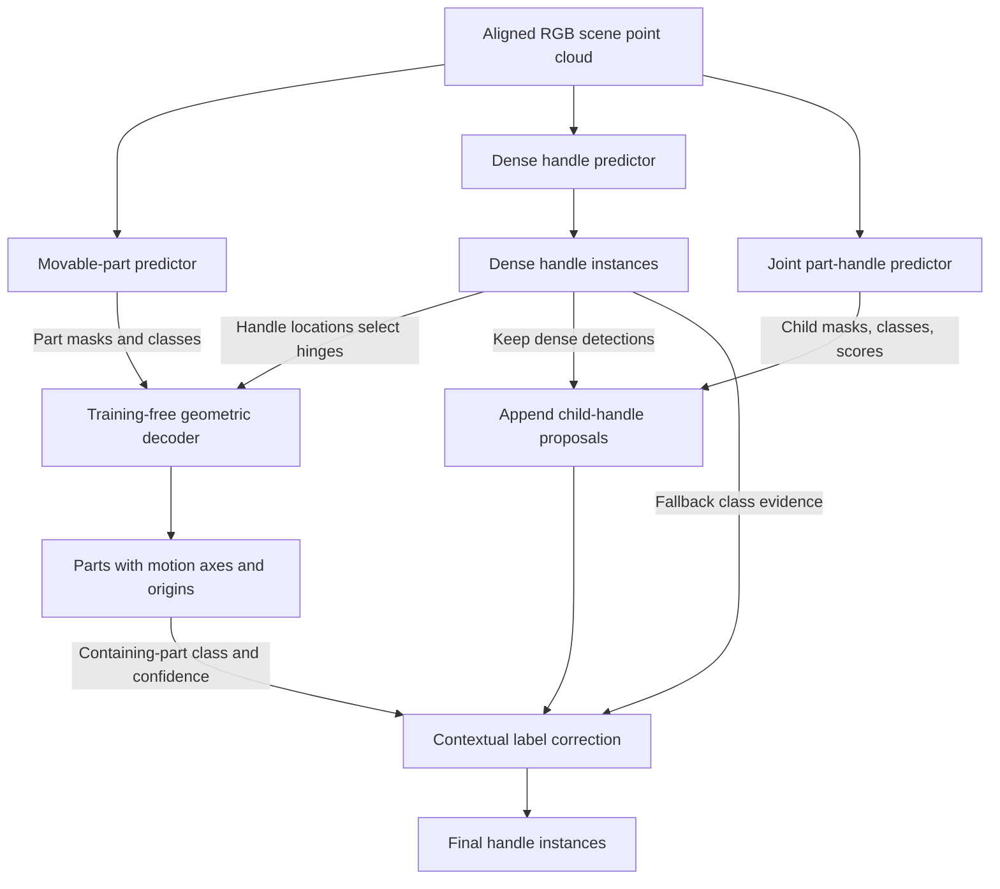

# Method and implementation

[Overview](../README.md) · [Data](DATA.md) · [Validation results](RESULTS_VAL.md) · [Checkpoints](../checkpoints/README.md)

Segment–Snap treats movable parts, motion, and handles as one interaction-understanding problem.
Large surfaces provide geometric structure; small handles provide an interaction cue that the
surface alone can leave ambiguous. The pipeline combines three learned predictors with a
training-free motion decoder and a one-pass contextual correction of handle labels.

## Three predictors, three responsibilities

All predictors receive the same aligned scene, with coordinates, RGB, and normals. They share
an architecture family, **not weights**: each is trained separately from a Volt-B initialization.

| Predictor | Representation and output | Role in the final result |
|---|---|---|
| Movable-part predictor | SPFormer queries over superpoints; part masks, classes, and scores | Supplies the final part instances and semantic context for handle correction |
| Dense handle predictor | Pointwise probabilities for background, rotation handles, and translation handles | Supplies the initial handles and the handle locations used by motion decoding |
| Joint part-handle predictor | Its own part queries, each with a fine-resolution child-handle mask | Supplies complementary handle proposals, initially labeled by their parent query |

A handle's rotation/translation label describes **the motion of the part it operates**, not a
separate motion estimate for the handle itself.

### How the joint predictor works

The joint model first builds part-query features by attending to the scene's superpoint features.
Its part head predicts parent masks and classes. A child head uses each of those **same query
features**, together with the backbone's finer voxel features, to predict a handle mask that is
mapped back to the original points. Both heads belong to one forward pass.

Thus the child head is conditioned on a parent **query feature**; it does not take a saved parent
mask as a second network input. Nor does it consume the standalone part predictor's output. The
joint model has its own parent predictions, used to identify, label, and score child proposals;
the standalone model supplies the final parts and the later contextual label correction.

### Information flow



The two directions use different information: **handles guide hinge geometry; parts guide handle
proposals and labels**. No arrow returns from the final handles to the motion decoder. The graph
is acyclic, and the three learned predictors can be evaluated independently before their outputs
are combined.

The source filenames retain `t1`, `t2`, and `s2` for compatibility with the original implementation:
these denote the part branch, dense handle branch, and joint proposal branch, respectively.
They are not three independent tasks in the method.

## From parts and handles to motion

### Segment the part surface

The part predictor uses a Volt-B backbone and a 200-query SPFormer decoder. Queries operate on
Felzenszwalb–Huttenlocher superpoints built from a 12-nearest-neighbor graph
(`k_thresh=0.005`, `seg_min=5`). This representation groups broad surfaces while retaining
boundaries needed by the part decoder.

The released selection rule assigns each query its highest-scoring motion class once, instead of
selecting globally from the flattened query-by-class grid. Instances smaller than four points
are discarded. See [per-query selection](../arti3d/models/spformer_argmax.py).

### Fit geometry to reliable support

For each retained part, take its largest connected component at a radius of 0.05 m as the fitting
support. **This changes the points used for fitting, not the output instance mask.** PCA estimates
the thin direction; a minimum-area rectangle over the projected convex hull supplies the in-plane
box axes. The support-point mean is used as the box centroid.

The box provides the following motion candidates:

| Part class | Axis rule | Origin rule |
|---|---|---|
| Rotation | Fixed world-Z direction: an upright-hinge prior | Handle-guided selection among four box-derived candidate hinge lines |
| Translation | Fitted surface normal: a per-part direction | Support centroid; translation origins are not constrained by the evaluator |

For a rotating part, the four candidate lines lie on **two physical sides**, each represented
across the plate thickness. Their direction is the chosen rotation axis.

### Use a handle to choose the hinge side

Dense probabilities are converted into handle instances using the same clustering rule as the
handle-output branch. For each handle centroid, measure its distance to the nearest point in the
part's fitting support. Select the closest handle if this distance is less than 0.5 m.

Among the candidate hinge lines, choose the one farthest from that handle. For example, a handle
on the right side of a cabinet door favors a hinge on the left. The emitted origin is the
perpendicular projection of the support centroid onto that line: a representative point on the
hinge, rather than a distinguished endpoint. If no nearby handle exists, use the support centroid.

Box fitting, axis selection, and hinge selection have **no learned parameters and no
motion-regression training**. They are implemented in [geometric decoding](../arti3d/geom/snap.py)
and [box fitting](../arti3d/geom/obb.py).

### Rescore fragmented instances

Multiply each part confidence by the fraction of its points in the largest connected component,
raised to a power `gamma` (released value: 1). This changes ranking, not masks or motion geometry.
See [connectivity rescoring](../arti3d/geom/rescore.py).

The [fixed-mask validation control](RESULTS_VAL.md#handles-disambiguate-hinge-placement) isolates
the handle cue: motion-gated AP50 rises from 13.74 to 40.98 without changing masks or axes.

## From part context to handles

### Retain fine-scale dense detections

The dense predictor classifies points rather than pooling handle targets into superpoints.
Foreground points are grouped into connected components at 0.025 m; components with fewer than
three points are removed. Each instance receives its points' majority motion class and mean
probability score. See [component extraction](../arti3d/prep/cluster.py).

### Add complementary child proposals

The joint predictor thresholds each child-handle probability mask at 0.30 and keeps nonempty
masks. Proposals inherit their parent query's class and confidence. They are not clipped to the
predicted parent mask, so a boundary error in the parent does not automatically remove a handle.

**Preserve query identity.** The part decoder filters and reorders queries during selection and
NMS. The child mask must be retrieved using the original query index, not the parent's position
in the returned instance array. The [query-tracking adapter](../arti3d/models/spformer_qtrack.py)
preserves this correspondence.

Append child detections at `0.05 × parent score`; keep all dense masks, classes, and scores intact.
The union script asserts that child scores are below dense scores **within each scene**. This is
not a universal guarantee that adding proposals improves dataset-level AP: the benefit is
measured by the [proposal control](RESULTS_VAL.md#parts-complement-dense-handle-detections).

### Correct only the new proposals' labels

For each appended child proposal:

1. Use the standalone part predictions after connectivity rescoring. Find parts with score at
   least 0.1 that contain at least 90% of the child's points. Select the highest-scoring one.
   If its score is at least 0.3 and its class
   differs from the child's, adopt that class.
2. If no differing part label was accepted, use the class of the dense detection that contains
   the largest fraction of the child, provided that fraction is at least 90%.
3. Otherwise keep the child's original class.

The second step can run even when a qualifying part agrees with the child's original label:
this is the implemented fallback policy. Only child **classes** can change. Their masks and
scores, and every dense detection, remain untouched. See [contextual correction](../scripts/classvote.py).

The released chain gains +5.01 pp from proposals and then +1.34 pp from label correction.
The latter includes dense-handle fallback, not just part context. Parts-only correction gives
+0.98 pp relative to the same uncorrected union. The full correction gain varies across child-model
seeds; conditioning alone is not established as the cause of the proposal gain.

## Running the pipeline

Complete [setup](../README.md#quick-start), [data preparation](DATA.md), and
[checkpoint download](../checkpoints/README.md) first. From the repository root:

```bash
DATA_ROOT=data/pointcept_mov \
LITE_ROOT=data/pointcept_lite \
ARTI3D_GT_ROOT=data/a3d/processed \
OUT=runs/reproduce_val \
  bash scripts/reproduce_val.sh
```

The reproduction script uses one valid sequential schedule for the dependency graph. Paths below
are relative to its output directory.

| Stage | Entrypoint | Reads | Writes |
|---|---|---|---|
| Dense probabilities | [`infer_t2_sem.py`](../scripts/infer_t2_sem.py) | Dense checkpoint and handle-view scene inputs | `t2_probs/<sid>_prob.npy` |
| Dense instances | [`instances_t2.py`](../scripts/instances_t2.py) | Probabilities and original point coordinates | `t2_single/t2_validation_preds.pkl` |
| Parts and motion | [`infer_t1.py`](../scripts/infer_t1.py) | Part checkpoint, part-view inputs, and `--handles t2_probs/` | `t1/t1_validation_preds.pkl` |
| No-handle control | `infer_t1.py`, without `--handles` | Same part checkpoint and scene inputs | `t1_centroid/t1_validation_preds.pkl` |
| Child proposals | [`infer_s2_child.py`](../scripts/infer_s2_child.py) | Joint checkpoint and both input views | `child.pkl` |
| Handle union | `instances_t2.py --union-child` | Dense probabilities and child proposals | `t2_union/t2_validation_preds.pkl` |
| Label correction | [`classvote.py`](../scripts/classvote.py) | Union predictions and final standalone parts | `t2_voted/t2_validation_voted_preds.pkl` |

`infer_t1.py --handles` reads the **probability directory**, not the dense-instance pickle:
it reconstructs the same handle components internally. The final handle union is never an
input to this decoder in the released pipeline. `metrics.json` is written beside the evaluated
part and handle prediction files; full AP values are fractions in [0, 1].

Each scene's final prediction dictionary stores `pred_masks` as `(N_points, N_instances)`, with
`pred_classes` and `pred_scores` indexed by instance. Parts additionally have `pred_axises`
(the serialized field's spelling) and `pred_origins`, both shaped `(N_instances, 3)`.
The handle union records `is_child` to limit relabeling to appended proposals. Child inference
writes a wrapper containing `preds` and `meta`, which the union script accepts directly.

Use a fresh output directory for a new experiment. Checkpoints and pickle predictions should be
loaded only from trusted sources.

<details>
<summary>Released inference settings and controls</summary>

| Setting | Default | Entrypoint / flag |
|---|---|---|
| Part selection | Per-query argmax | `infer_t1.py --topk-rule argmax` |
| Smallest part | 4 points | `infer_t1.py --min-points 4` |
| Fitting-support radius | 0.05 m | `infer_t1.py --snap-largest-cc 0.05` |
| Axis rule | Vertical rotations; surface-normal translations | `infer_t1.py --axis-rule canonical` |
| Handle association gate | 0.5 m | `infer_t1.py --handle-max-dist 0.5` |
| Part rescoring | Power 1, radius 0.05 m | `infer_t1.py --gamma 1 --cc-radius 0.05` |
| Dense component radius | 0.025 m | `instances_t2.py --radius 0.025` |
| Smallest dense handle | 3 points | `instances_t2.py --min-points 3` |
| Child mask threshold | 0.30 | `infer_s2_child.py --thr 0.30` |
| Child association | Original query index | `infer_s2_child.py --association query` |
| Child score scale | 0.05 | `instances_t2.py --union-scale 0.05` |
| Part voting score | 0.3 | `classvote.py --part-score 0.3` |

The motion branch's handle extraction defaults to the same radius and size floor via
`--handle-radius 0.025 --handle-min-points 3`. Its fitting-support cleanup can be disabled with
`--snap-largest-cc 0`; rescoring can be disabled with `--gamma 0`.

</details>

**Known command-line issue:** in the current code, `infer_s2_child.py --help` fails while
formatting an unescaped percent sign in an argument description. The settings table above and
the [entrypoint source](../scripts/infer_s2_child.py) document its interface. This is a help-text
formatting error; the documentation update does not modify the inference implementation.

## Training

Training is optional if you only want to evaluate the released checkpoints. Prepare all training
annotations as described in the [data guide](DATA.md), then obtain the upstream Volt-B ScanNet++
initialization following the [checkpoint guide](../checkpoints/README.md#which-weights-inference-uses).
Each predictor starts from that initialization and is trained independently.

Install the trainer's logging dependencies in the same environment before launching a run:

```bash
python -m pip install wandb tensorboardX
```

The upstream trainer imports these packages even when external experiment logging is disabled.
The released configurations set `enable_wandb=False`; installing the import dependency does not
require enabling online logging.

| Predictor | Training configuration | Supervision |
|---|---|---|
| Movable parts | [`insseg-spformer-volt-B-s1a-long.py`](../configs/arti3d/insseg-spformer-volt-B-s1a-long.py) | Hungarian-matched classification, mask BCE, and Dice |
| Dense handles | [`semseg-volt-B-armA-long.py`](../configs/arti3d/semseg-volt-B-armA-long.py) | Weighted cross-entropy and Lovász loss |
| Joint part-handle | [`insseg-s2-joint-volt-B.py`](../configs/arti3d/insseg-s2-joint-volt-B.py) | Part losses plus child BCE, Dice, and Tversky losses |

All three recipes specify 400 epochs, AdamW configured with learning rate `3e-4`, a one-cycle
schedule, batch size 2 with eight-step gradient accumulation, mixed-precision training, and EMA.
The dense recipe uses a coarse-to-fine target schedule: 0.10 m dilation for the first 50% of
training, 0.04 m until 80%, then undilated targets. This is a documented training choice, not a
separately established contribution.

Launch a model from the repository root with an explicit output directory. For example:

```bash
export PYTHONPATH="$PWD:$PWD/third_party/volt"
export OMP_NUM_THREADS=1 MKL_NUM_THREADS=1

python third_party/volt/tools/train.py \
  --config-file configs/arti3d/insseg-spformer-volt-B-s1a-long.py \
  --num-gpus 1 \
  --options save_path=exp/parts
```

For the other predictors, choose the corresponding configuration and a different `save_path`.
The trainer accepts **`key=value`** overrides after `--options`. Without a `save_path` override,
the inherited destination is `exp/default`.

For custom data locations, update the nested `data.train.data_root`, `data.val.data_root`, and
`data.test.data_root` entries; changing only top-level `data_root` does not rebuild those
already-defined dictionaries. The joint model also needs each split's `child_root` updated.
The pretrained initialization path can be overridden with `weight=/path/to/volt-base-scannetpp.pth`.

Optimization uses the training split. Validation is used for checkpoint and recipe selection,
so retraining and selection are not a validation-blind protocol. See the
[checkpoint disclosure](../checkpoints/README.md#training-and-selection-disclosure).
Inference uses full precision with TF32 disabled; changing precision can affect masks, component
connectivity, and ranking. A new training run is not expected to reproduce identical weights.

## Assumptions and limits

The geometry is intended for approximately planar, upright indoor mechanisms such as cabinet doors
and drawers. Non-vertical hinges, unusual translation directions, missing handles, and fragmented
or incomplete part predictions can violate its assumptions. The method does not estimate a full
motion trajectory or demonstrate downstream robotic manipulation.

The quantitative evidence comes from Articulate3D validation. Coupling is the method's organizing
idea; it is not a claim of generalization to every mechanical object or dataset. See
[validation results and failure analysis](RESULTS_VAL.md) for the measured scope.
